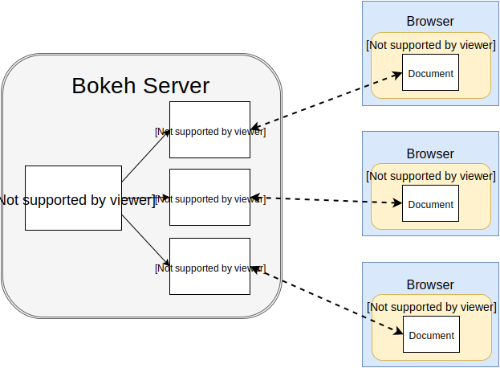

The two dominant data science programming languages scoped in this project are `python` and `R`

# Python

# Bokeh
  
[Bokeh widgets](https://docs.bokeh.org/en/latest/docs/user_guide/interaction/widgets.html)  
[Bokeh for notebooks](https://github.com/bokeh/bokeh/blob/1.4.0/examples/howto/notebook_comms/Jupyter%20Interactors.ipynb)  
[bokeh plot for (geo)pandas](https://pythonawesome.com/bokeh-plotting-backend-for-pandas-and-geopandas/)  

Only bokeh (no plotly/matplotlib)?  
https://stackoverflow.com/questions/44499971/importerror-cannot-import-name-mpl-from-matplotlib-import-mpl
https://github.com/bokeh/bokeh/issues/2277  

## Dash
[getting started](https://dash.plot.ly/getting-started)  
Examples for using http://dash.plot.ly/

My main issue with Dash (as compared to Shiny) is is it difficult to _share data between callbacks_
> In order to share data safely across multiple python processes, we need to store the data somewhere that is accessible to each of the processes. There are three main places to store this data:  
1 - In the user's browser session  
2 - On the disk (e.g. on a file or on a new database)  
3 - In a shared memory space like with Redis  
[sharing-data-between-callbacks](https://dash.plot.ly/sharing-data-between-callbacks)  
[Dash: Add reactive expressions / blocks issue](https://github.com/plotly/dash/issues/49#issuecomment-311511286) 

> This is where Shiny is miles ahead of Dash 
[[shiny-vs-dash-a-side-by-side-comparison](https://www.rkingdc.com/blog/2019/3/6/shiny-vs-dash-a-side-by-side-comparison)].

Plotly offline?
https://community.plot.ly/t/offline-dash-application/6017

# R
## Shiny
Shiny is by leaps and bounds the most popular web application framework for R [shiny-vs-dash-a-side-by-side-comparison](https://www.rkingdc.com/blog/2019/3/6/shiny-vs-dash-a-side-by-side-comparison)

[shinydashboard](https://rstudio.github.io/shinydashboard/) 
[Shiny: interactive chart packages](https://beta.rstudioconnect.com/content/2792/Interactive%20Dashboards%20Shiny.nb.html) 
[DataTable options](https://rstudio.github.io/DT/options.html)
## Dash
It looks like [DASH HAS GONE FULL R](https://moderndata.plot.ly/dash-has-gone-full-r/)

## Panel
https://medium.com/@philipp.jfr/panel-announcement-2107c2b15f52

## flexdashboard
[flexdashboard-easy-interactive-dashboards-for-r](https://blog.rstudio.com/2016/05/17/flexdashboard-easy-interactive-dashboards-for-r/)

# Jupyter notebooks interactive widgets
JUlia PYThon R code may be used in Jupyter notebooks and combined with [[ipywidgets](https://ipywidgets.readthedocs.io/en/stable/index.html), [jupyter widgets](https://jupyter.org/widgets)]
and hiding code/cells, etc. one can create a minimal dashboard user experience.  
Other noteworthy tools include:
- [Qgrid: An interactive grid for sorting, filtering, and editing DataFrames in Jupyter notebooks](https://github.com/quantopian/qgrid)
- [Rise: turn notebook into a live reveal.js-based presentation](https://rise.readthedocs.io/en/maint-5.6/)
- [nbextensions: hide_input/](https://jupyter-contrib-nbextensions.readthedocs.io/en/latest/nbextensions/hide_input/readme.html)
- [jupyterbook: hiding](https://jupyterbook.org/features/hiding.html)

[nbinteract](https://www2.eecs.berkeley.edu/Pubs/TechRpts/2018/EECS-2018-57.pdf)

# Comparisons

# Examples
[examples](/examples)

# Other worthy blogs  
https://www.quora.com/Is-there-something-similar-to-R-Shiny-for-Python-users-in-the-scientific-community  
https://www.sicara.ai/blog/2018-01-30-bokeh-dash-best-dashboard-framework-python  
https://github.com/flavianh/dashboards-frameworks-comparison  
https://medium.com/y-data-stories/python-and-bokeh-part-ii-d81024c9578f  
https://towardsdatascience.com/data-visualization-with-bokeh-in-python-part-one-getting-started-a11655a467d4  
https://towardsdatascience.com/data-visualization-with-bokeh-in-python-part-iii-a-complete-dashboard-dc6a86aa6e23  
https://towardsdatascience.com/creating-interactive-dashboards-in-r-shiny-using-python-scripts-as-the-backend-aed40e18fb3f
